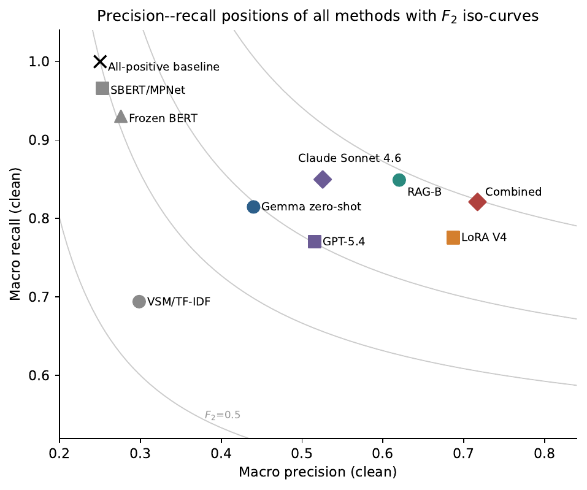
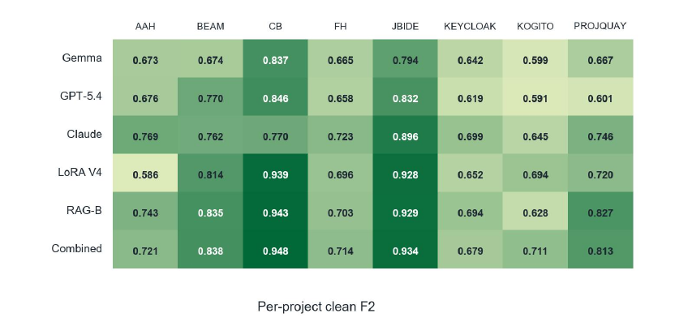

# LLM Requirements Traceability Thesis Artefacts

This repository contains the data, scripts, predictions, result summaries, and figures produced for a master's thesis on large language models for cross-level requirements traceability.

The study evaluates traceability link recovery as the second stage of a retrieve-then-classify pipeline. Instead of testing on random non-links, each positive hierarchy link is paired with semantically similar hard negatives mined with Qwen3 embeddings. This makes the classification task deliberately difficult: models must distinguish true refinement or decomposition links from issue pairs that look plausible under lexical or embedding similarity.

## Repository Scope

The repository is an archive of the artefacts used and produced during the thesis. It is intended to make the experimental record inspectable and to connect the reported results to the corresponding data and implementation.

It is not currently presented as a self-contained reproduction package. Model weights, trained adapters, retrieval indexes, exact software environments, API access, and compute infrastructure are not packaged. A publication-oriented release may add these elements later.

## Repository Structure

```text
llm-requirements-traceability/
|-- DATA/
|   |-- RAW_DATA/       # Source Jira exports
|   `-- .GROUND_TRUTH/  # Constructed benchmark and fixed pair splits
|-- SCRIPT/             # Data-analysis and experiment implementations
|-- RESULTS/            # Predictions, result summaries, tests, and figures
|-- docs/       # README figures
|-- README.md
```

Detailed documentation:

- [DATA/README.md](DATA/README.md): source exports, benchmark construction, and project-level counts.
- [SCRIPT/README.md](SCRIPT/README.md): high-level method descriptions and script-to-result mapping.
- [RESULTS/README.md](RESULTS/README.md): prediction directories, consolidated outputs, and figures.

## Experimental Flow

1. The Jira exports in `DATA/RAW_DATA/` provide issue text, issue types, and recorded links for eight open-source projects.
2. The two scripts in `DATA/` reconstruct the mapped adjacent-level hierarchy and create the fixed 1:3 hard-negative train, validation, and test pairs in `DATA/.GROUND_TRUTH/`.
3. Scripts `1`-`3` establish TF-IDF, sentence-embedding, and frozen-BERT baselines.
4. Script `4` screens open-weight LLMs; script `5` evaluates the selected Gemma 4 31B model without project-specific adaptation.
5. Scripts `6`-`8` evaluate retrieval-augmented in-context learning, QLoRA fine-tuning, and their combination.
6. `9c_zero_shot_claude_batch_matched.py`, `9d_zero_shot_openai_batch_matched.py`, and `9e_merge_openai_batch_shards.py` provide the matched Claude Sonnet 4.6 and GPT-5.4 zero-shot comparisons.
7. The separate `9.stratified_eval_by_link_type.py`, `10_significance_tests.py`, and `11_generate_thesis_figures_v2.py` scripts produce the link-type analysis, project-level statistical checks, and current thesis figures.

The exact input and output locations for each script are listed in [SCRIPT/README.md](SCRIPT/README.md).

## Benchmark Summary

The committed processed benchmark contains:

| Quantity | Count |
| :--- | ---: |
| Projects | 8 |
| Requirements | 11,680 |
| Positive trace links | 10,503 |
| Training pairs | 27,308 |
| Validation pairs | 4,036 |
| Held-out test pairs | 10,668 |
| Committed per-pair prediction files | 178 |

These are the final controlled benchmark counts. The reduction from 42,525 denoised issue records and 27,751 raw link records, together with the 3,342,078-pair hierarchy-valid candidate space, is documented in the [DATA construction funnel](DATA/README.md#construction-funnel).

## Main Results

All values below are macro-averaged over the eight projects using clean scoring unless noted otherwise.

| Method | Precision | Recall | Macro F1 | Macro F2 | Accuracy | Mean latency (ms/pair) | P95 latency (ms/pair) |
| :--- | ---: | ---: | ---: | ---: | ---: | ---: | ---: |
| All-positive sanity check | 0.2500 | 1.0000 | 0.4000 | 0.6250 | 0.2500 | - | - |
| VSM / TF-IDF | 0.2984 | 0.6941 | 0.4139 | 0.5433 | 0.5080 | - | - |
| SBERT / all-mpnet-base-v2 | 0.2528 | 0.9663 | 0.4006 | 0.6174 | 0.2761 | - | - |
| Frozen BERT + MLP | 0.2758 | 0.9304 | 0.4219 | 0.6238 | 0.3486 | - | - |
| Gemma 4 31B zero-shot | 0.4399 | 0.8148 | 0.5693 | 0.6938 | 0.6888 | 1,021.8 | 1,236.3 |
| OpenAI GPT-5.4 zero-shot | 0.5157 | 0.7704 | 0.6157 | 0.6991 | 0.7575 | async batch | async batch |
| Claude Sonnet 4.6 zero-shot | 0.5255 | 0.8498 | 0.6443 | 0.7511 | 0.7585 | async batch | async batch |
| Gemma 4 31B QLoRA V4 | 0.6872 | 0.7757 | 0.7253 | 0.7537 | 0.8514 | 1,551.9 | 1,628.2 |
| Gemma 4 31B RAG-B | 0.6202 | 0.8491 | 0.7135 | 0.7878 | 0.8242 | 2,096.2 | 3,304.9 |
| Gemma 4 31B LoRA + RAG | 0.7170 | 0.8212 | 0.7612 | 0.7947 | 0.8670 | 1,810.3 | 2,996.8 |

Clean scoring excludes unparseable generative outputs. Conservative scoring instead treats an unparseable output as a negative prediction: a failure on a positive pair becomes a false negative, while a failure on a negative pair becomes a true negative. Truncation is not penalised separately when the resulting output remains parseable.

| Local generative method | Clean Macro F2 | Conservative Macro F2 | Parse failures | Input cap hits |
| :--- | ---: | ---: | ---: | ---: |
| Gemma 4 31B zero-shot | 0.6938 | 0.6932 | 13 | 13 inferred |
| Gemma 4 31B QLoRA V4 | 0.7537 | 0.7522 | 27 | 27 |
| Gemma 4 31B RAG-B | 0.7878 | 0.7800 | 206 | 207 |
| Gemma 4 31B LoRA + RAG | 0.7947 | 0.7868 | 201 | 207 |

The zero-shot run did not retain a separate truncation flag; its 13 cap hits are inferred from inputs that reached the executed 8,192-token limit. The other cap-hit values were logged explicitly. A dash in the latency columns means that no directly comparable measurement was collected under the final local single-stream H100 protocol. Cloud models were executed through asynchronous provider batch APIs and are therefore not compared on local latency.

<p align="center">
  
</p>

<p align="center">
  
</p>

## Main Takeaways

1. Similarity-oriented baselines struggle under the hard-negative protocol. SBERT and Frozen BERT approach the all-positive sanity check but do not provide a strong discriminative signal.
2. Zero-shot LLMs provide a stronger second-stage traceability signal. Claude Sonnet 4.6 is the strongest zero-shot model among the evaluated cloud/local models.
3. Project-specific adaptation improves the local open-weight model. RAG-B reaches macro F2 = 0.7878, LoRA V4 reaches macro F2 = 0.7537, and the combined LoRA+RAG configuration reaches macro F2 = 0.7947.
4. The combined method has the highest absolute macro F2, but its advantage over RAG-B is not statistically robust across the eight projects (Wilcoxon p = 1.0000; bootstrap 95% CI [-0.0102, 0.0309]).

## License and Provenance

- Code, scripts, and committed prediction files are released under the MIT License.
- The Jira exports originate from eight public open-source projects and were obtained through the dataset resources supplied by Tian et al.
- The source exports retain the provenance and terms of their originating projects and are not relicensed under this repository's MIT License.
- The processed benchmark in `DATA/.GROUND_TRUTH/` was constructed from those exports for this thesis.
